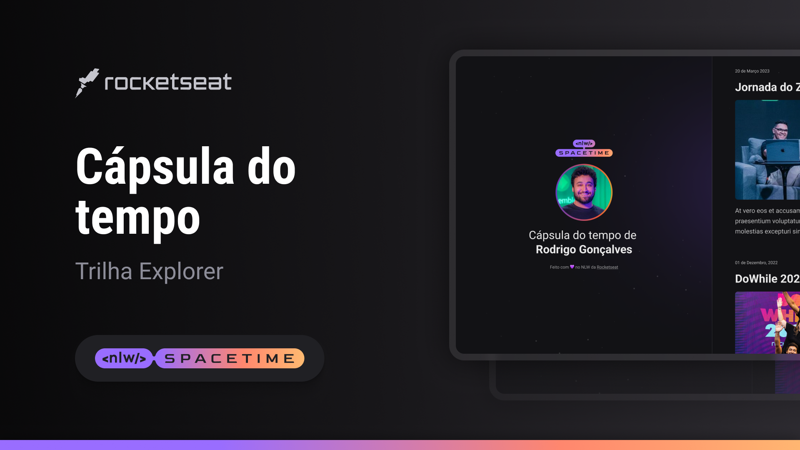

[Projeto Spacetime](https://alisson-vml.github.io/Spacetime/)

  

## 💻 Projeto

Esse é um projeto é uma cápsula do tempo para exibir memoria em uma linha do tempo

## 🚀 Tecnologias

Esse projeto foi desenvolvido durante o NLW da Rocketseat com as seguintes tecnologias:

-HTML
-CSS
-Git e Github

## 🏷️ Layout

Você pode visualizar o layout do rojeto através
[desse link](https://www.figma.com/file/Elk1SEoIcIMQ6mMWmtGb8L/C%C3%A1psula-do-tempo-%E2%80%A2-Trilha-Explorer-Rocketseat?type=design&node-id=306%3A84&t=uczZ9WJJy99t62vB-1).
